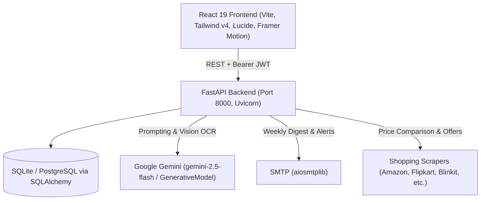

# FinMate 2.0 — Comprehensive Architecture Audit (Phase 0)

**Date**: September 22, 2026  
**Repository**: FinMate 2.0  
**Status**: Pre-modification Audit Completed  

---

## 1. System Overview & Current Architecture

FinMate is currently structured as a monolithic FastAPI backend with a React (Vite) single-page application frontend. It provides personal financial tracking, basic AI advisory and debt/purchase debating features, receipt OCR, CSV imports, gamification, and simple spending analytics.

---

## 2. Frontend Structure & Communication

- **Location**: `frontend/`
- **Framework**: React 19.2.0, TypeScript 5.9.3, Vite 7.3.1, Tailwind CSS 4.2.1
- **Routing**: `react-router-dom` v7 (`/`, `/login`, `/signup`, `/dashboard`, fallback `*` -> `/`)
- **State & Authentication**:
  - `AuthContext.tsx` handles user session, stores JWT token and user profile in `localStorage` (`finmate_token`, `finmate_user`).
  - Axios headers: `Authorization: Bearer <token>`.
- **API Base Configuration**: `frontend/src/apiConfig.ts` reads `import.meta.env.VITE_API_URL` defaulting to `http://127.0.0.1:8000`.
- **Dashboard Sections**:
  1. `overview`: Summary cards (income, spending, health score), quick actions, recent transactions, spend breakdowns.
  2. `transactions`: `TransactionsList.tsx` with transaction table, search, category filter, manual form modal, CSV upload modal.
  3. `subscriptions`: `SubscriptionsSuspectsPage.tsx` listing candidate subscriptions with "Keep" or "Cancel" actions.
  4. `prediction`: `PredictionPage.tsx` displaying simple category trends and run-rate projections.
  5. `debate`: `DebatePurchaseV2.tsx` (and legacy `DebatePurchase.tsx`) for product URL/query comparison across e-commerce providers with AI personas (FrugalCoach, ValueAnalyst, ConvenienceAdvocate, Referee).
  6. `coach`: `CoachPage.tsx` embedding `ChatInterface.tsx` with regular and "Roast Mode" AI financial advisory.
  7. Additional sub-components: `HealthScore.tsx`, `BudgetGoals.tsx`, `Gamification.tsx`, `Insights.tsx`, `DataImport.tsx`.

---

## 3. Backend Structure & Code Organization

- **Root files**:
  - `backend/main.py` (72.5 KB, 1,891 lines): Houses all route declarations, in-line helper functions, Gemini prompt builders, CSV handling, and database operations.
  - `backend/models.py`: SQLAlchemy ORM definitions (`User`, `FinancialProfile`, `Transaction`, `BudgetGoal`, `UserStats`, `Achievement`, `Notification`, `ReceiptPending`, `SubscriptionDecision`).
  - `backend/schemas.py`: Pydantic schemas (V2 syntax with V1-style class Config).
  - `backend/database.py`: SQLAlchemy connection, session maker, `get_db` dependency.
  - `backend/auth.py`: JWT generation, password verification (`passlib[bcrypt]`), `get_current_user` dependency.
  - `backend/ai_insights.py`: Gemini-driven anomaly analysis, weekly digest, budget optimization, unusual expense detection, cancellation email draft generator.
  - `backend/gamification.py`: XP rewards, achievement triggers, streak tracking.
  - `backend/debate.py` & `backend/debate_cache.py`: E-commerce offer aggregation, scoring heuristic, debate persona synthesis.
  - `backend/email_service.py`: `aiosmtplib` wrapper for transactional alerts and weekly digest HTML emails.
  - `backend/utils.py`: Validation helpers, financial health scoring, category mapping dictionary, CSV header normalizer, candidate ID hashing.
  - `backend/providers/`: Modular scrapers (`site_scrapers.py`, `playwright_scrapers.py`, `google_shopping_scraper.py`, `web_search.py`, `enhanced_scrapers.py`).

---

## 4. Complete API Endpoint Inventory

| Method | Endpoint | Description | Auth Required |
|---|---|---|---|
| GET | `/` | Root health welcome | No |
| GET | `/health` | Health status check | No |
| POST | `/signup` | User registration | No |
| POST | `/login` | User login (OAuth2 password flow, returns JWT) | No |
| GET | `/me` | Current authenticated user profile | Yes |
| POST | `/transactions` | Create single transaction (with category suggestion) | Yes |
| GET | `/transactions` | List user transactions (supports limit, offset, search) | Yes |
| PUT | `/transactions/{transaction_id}` | Edit an existing transaction | Yes |
| DELETE | `/transactions/{transaction_id}` | Delete transaction | Yes |
| POST | `/upload-csv/preview` | Preview and parse CSV columns prior to import | Yes |
| POST | `/upload-csv` | Import CSV transactions into database | Yes |
| GET | `/analytics` | Total spent, category breakdown, recent items | Yes |
| GET | `/analytics/weekly` | 7-day spending trends | Yes |
| GET | `/analytics/overview` | Monthly totals, daily spending, income comparisons | Yes |
| GET | `/analytics/enhanced` | Enhanced multi-factor health metrics and charts | Yes |
| GET | `/analytics/trends` | Historical monthly category trends | Yes |
| POST | `/scan-receipt` | Direct receipt OCR via Gemini Vision | Yes |
| POST | `/receipts/scan-and-confirm` | Stage receipt into `ReceiptPending` table | Yes |
| POST | `/receipts/{receipt_id}/confirm` | Confirm staged receipt into active transaction | Yes |
| POST | `/chat` | Conversational financial coach & chat actions | Yes |
| POST | `/goals` | Create budget goal | Yes |
| GET | `/goals` | List user budget goals | Yes |
| PUT | `/goals/{goal_id}` | Update budget goal | Yes |
| DELETE | `/goals/{goal_id}` | Delete budget goal | Yes |
| GET | `/stats` | User gamification stats (XP, streak, totals) | Yes |
| GET | `/achievements` | Unlocked user achievements | Yes |
| GET | `/notifications` | User notifications | Yes |
| PUT | `/notifications/{notification_id}/read`| Mark notification as read | Yes |
| GET | `/insights/anomalies` | Detected spending anomalies | Yes |
| GET | `/insights/weekly-digest` | Weekly digest data | Yes |
| GET | `/insights/budget-optimization` | AI-suggested budget optimizations | Yes |
| GET | `/leaderboard/savings-rate` | Gamification leaderboard | Yes |
| POST | `/debate/offers` | Fetch e-commerce offers for a query | Yes |
| POST | `/debate/run` | Run multi-agent purchase debate | Yes |
| GET | `/subscriptions/detect` | Detect recurring candidate subscriptions | Yes |
| POST | `/subscriptions/{candidate_id}/action` | Trigger subscription email action | Yes |
| GET | `/subscriptions/suspects` | List suspect recurring charges | Yes |
| POST | `/subscriptions/suspects/{candidate_id}/decision` | Store keep/cancel decision | Yes |

---

## 5. Database Schema & Tables

1. `users`: `user_id`, `email`, `password_hash`, `full_name`, `created_at`, `preferences`, `currency`, `currency_symbol`.
2. `financial_profiles`: `profile_id`, `user_id` (FK), `monthly_income`, `employment_type`, `risk_tolerance`, `updated_at`.
3. `transactions`: `transaction_id`, `user_id` (FK), `amount`, `category`, `date`, `description`, `source`.
4. `budget_goals`: `goal_id`, `user_id` (FK), `goal_type`, `target_amount`, `deadline`, `current_progress`, `status`, `created_at`.
5. `user_stats`: `stat_id`, `user_id` (FK), `total_xp`, `current_streak`, `longest_streak`, `total_transactions`, `total_spending`, `last_streak_date`, `updated_at`.
6. `achievements`: `achievement_id`, `user_id` (FK), `achievement_type`, `title`, `description`, `icon`, `xp_reward`, `unlocked_at`.
7. `notifications`: `notification_id`, `user_id` (FK), `title`, `message`, `notification_type`, `is_read`, `created_at`.
8. `receipts_pending`: `receipt_id`, `user_id` (FK), `extracted_data`, `receipt_image_path`, `status`, `created_at`.
9. `subscription_decisions`: `decision_id`, `user_id` (FK), `candidate_id`, `merchant`, `avg_amount`, `interval_days`, `occurrences`, `last_seen_at`, `action`, `created_at`.

---

## 6. External Services & Dependencies

- **AI Model**: Google Gemini (`google-generativeai` / `google.genai` SDK), using `gemini-2.5-flash`.
- **Email Delivery**: SMTP via `aiosmtplib`.
- **Database Drivers**: `sqlite3` for local development, `psycopg2-binary` for PostgreSQL on Render/production.
- **Scraping / Providers**: BeautifulSoup4, lxml, requests, Playwright (optional).
- **Frontend Assets**: Framer Motion, Lucide icons, Recharts.

---

## 7. Known Technical Debt & Risky Areas

1. **Massive `main.py` Monolith**: Over 1,800 lines in a single file mixing routing, SQL queries, business logic, LLM prompts, and CSV validation.
2. **Missing Service/Repository Layer**: Direct database queries (`db.query(...)`) executed directly inside route handlers.
3. **No Migration System Configured**: Alembic is in requirements, but no `alembic.ini` or migration versions directory exists. Schema changes have historically been done via ad-hoc scripts like `migrate_currency.py` and `Base.metadata.create_all()`.
4. **Pydantic V2 Deprecation Warnings**: Schemas use `class Config:` instead of `ConfigDict` or `model_config = ConfigDict(...)`.
5. **Python 3.14 Datetime Deprecation**: Widespread usage of `datetime.utcnow()` which is deprecated in modern Python in favor of `datetime.now(datetime.UTC)`.
6. **LLM Calculations**: Some financial reasoning in chat endpoints is performed by prompt context rather than deterministic business logic before rendering.
7. **Test Database Teardown Lock**: On Windows, `test_main.py` test cleanup fails with `PermissionError` when removing `test.db` because SQLite connections remain held until `engine.dispose()` is called.
8. **Frontend Vitest Missing Environment**: Frontend test suite failed with `document is not defined` because `jsdom` is not configured in `vite.config.ts`.
9. **Endpoint Naming Inconsistency**: Prompt lists `POST /import-csv`, but backend implements `POST /upload-csv`. Both must be supported seamlessly.

---

## 8. Recommended Extension Points for FinMate 2.0

1. **API Router Layer**: Create `backend/app/api/v1/` routes while keeping `backend/main.py` mounting them or maintaining 100% backward-compatible forwarders.
2. **Service & Repository Pattern**:
   - `repositories/`: `UserRepository`, `TransactionRepository`, `GoalRepository`, `SubscriptionRepository`.
   - `services/`: `TransactionService`, `AnalyticsService`, `AnomalyService`, `ForecastingService`, `CashflowService`, `SimulationService`.
3. **Financial Intelligence Engine (`backend/app/analytics/` & `backend/app/ai/`)**:
   - Deterministic rule and mathematical engines for cash flow, forecasting, and anomaly scoring.
   - Guardrailed context builder and prompt manager for Gemini.
4. **Transaction Pipeline**: Centralized ingestion pipeline covering manual entries, CSV parsing, and OCR extractions with deduplication and normalized fingerprinting.
5. **Alembic Versioning**: Initialize Alembic with a baseline migration reflecting existing schema before introducing new columns/tables.
